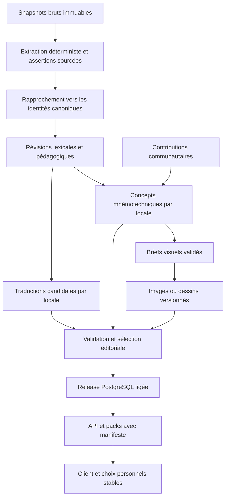

# Audit du cœur de contenu de Jibiki

> Mise à jour du 29 septembre 2026 : les constats de cet audit sont conservés. La proposition d'infrastructure éditoriale durable est remplacée, pour le chantier actuel, par le [plan de consolidation ponctuelle](CONTENT_PRODUCTION_PLAN.md) et son [modèle simplifié](CONTENT_DATA_MODEL.md).

Date : 23 septembre 2026. Objet : traductions, kana, kanji, mots, mnémotechniques, images, contributions et diffusion hors ligne.

**Décision recommandée : conserver le socle lexical et reconstruire la chaîne éditoriale au-dessus.** Le projet a de bonnes fondations pour consulter un dictionnaire multilingue. Il ne possède pas encore la chaîne permettant de transformer systématiquement des sources hétérogènes en contenus pédagogiques révisés, illustrés, propres à chaque langue et mis à jour sans perte.

Le prochain investissement doit porter sur les identités, les révisions, les cibles pédagogiques et les contrats de publication. Lancer maintenant des milliers de traductions ou d'images créerait un stock difficile à intégrer et à maintenir.

| Priorité | Décision |
| --- | --- |
| Avant toute traduction massive | Protéger les contenus éditoriaux des réimports et stabiliser les identités/révisions de sens |
| Avant le pilote multilingue | Ajouter les cibles mots/lectures et un contrat de locale extensible |
| Avant la génération d'images | Valider les concepts linguistiques et les briefs géométriques ; versionner texte et média ensemble |
| Avant la diffusion du catalogue de base | Définir une sélection éditoriale, garantir sa couverture et son accès hors ligne |
| Après le circuit pilote | Étendre les langues et cibles par campagnes mesurées, avec la communauté |

## 1. Périmètre et niveau de preuve

L'audit porte sur le **répertoire de travail actuel**, qui contient de nombreuses modifications et additions antérieures non commitées. Elles ont été lues comme l'état du projet, sans être annulées. Aucun import, aucune migration, aucune publication ni génération d'image n'a été exécuté pendant cet audit.

Ont été examinés : les modèles Django, les importeurs, les seeds, les parseurs, les catalogues de sources, la génération des packs, les lecteurs Flutter, les mécanismes de contribution et les essais locaux d'images. Les sources textuelles ont été échantillonnées pour examiner les mécanismes pédagogiques. Ce travail ne constitue pas une validation linguistique exhaustive de chaque histoire.

La connexion PostgreSQL configurée a expiré. Les volumes ci-dessous sont donc ceux des **artefacts locaux de la release du 9 septembre**, recomptés le 23 septembre, et non une mesure d'un serveur en production. Six bases SQLite ont été décompressées en mémoire, interrogées en lecture seule et contrôlées. Les empreintes compressées de tous les packs déclarés dans le manifeste local ont été vérifiées.

Le catalogue de scraping a été recompté. Ses statistiques détaillées par champ proviennent du rapport du 9 septembre. Les tailles des cinq fichiers d'extraction correspondent encore à ce rapport ; un contrôle intégral de toutes leurs empreintes n'est pas revendiqué ici. Les PDF et captures sont inventoriés, mais n'ont pas fait l'objet d'une transcription intégrale pendant cet audit.

Livrables de preuve :

- [Mesures reproductibles](C:/Users/sauron/Documents/Personnal/jibiki/docs/audits/2026-09-23-content/measurements.json).
- [Script de mesure](C:/Users/sauron/Documents/Personnal/jibiki/docs/audits/2026-09-23-content/measure.py).
- [Sondes de validation des langues et cibles](C:/Users/sauron/Documents/Personnal/jibiki/docs/audits/2026-09-23-content/probes.json).
- [Commandes et résultats des tests](C:/Users/sauron/Documents/Personnal/jibiki/docs/audits/2026-09-23-content/checks.json).
- [Proposition de 300 kanji](C:/Users/sauron/Documents/Personnal/jibiki/docs/audits/2026-09-23-content/kanji-baseline-proposal.csv).
- [Matrice de 1 016 lignes de couverture](C:/Users/sauron/Documents/Personnal/jibiki/docs/audits/2026-09-23-content/baseline-gaps.csv), pour 208 cibles kana et les 300 kanji proposés, en EN/FR. Elle couvre les histoires de forme/sens ; les lectures multiples et les futures langues devront avoir leurs propres lignes.

## 2. État des lieux mesuré

| Élément | Présent dans les artefacts examinés | Interprétation |
| --- | ---: | --- |
| Lignes de mots du core | 218 758 | Comprend les références historiques et alias ; ce n'est pas un nombre de lexèmes neufs |
| Formes de mots | 499 059 | Écritures et lectures |
| Sens source | 678 102 | La segmentation n'est pas universellement alignée entre langues |
| Kanji | 13 108 | Couverture lexicale, sans promesse d'illustration de chacun |
| Cibles kana | 208 | 92 de base, 40 dakuten, 10 handakuten, 66 yōon |
| Radicaux/composants catalogués | 260 | Le modèle ne représente pas toutes les conceptions pédagogiques d'un composant |
| Mots avec définitions anglaises | 218 758 | 443 079 gloses sur 253 544 sens |
| Mots avec définitions françaises | 15 368 | 33 833 gloses sur 16 521 sens, environ 7 % des lignes de mots |
| Kanji avec sens anglais | 10 384 | 24 824 gloses, pas 13 108 kanji intégralement expliqués |
| Kanji avec sens français | 2 066 | 7 643 gloses |
| Histoires kana diffusées | 184 | 92 EN et 92 FR, toutes `unverified` |
| Images dans ces packs mnémotechniques | 0 | Les essais visuels locaux ne sont pas distribués avec les histoires |
| Histoires kanji diffusées dans ces packs | 0 | Le stock de briefs n'est pas le stock publié |
| Briefs de sens kanji | 2 211 cibles × 2 langues | 4 422 textes candidats |
| Briefs de lecture kanji | 2 203 cibles × 2 langues | 4 406 textes candidats, uniquement des on'yomi dans ces fichiers |
| Relectures documentées dans les fichiers de seeds | 0 | Pour les 184 histoires kana et 8 828 textes kanji |

Les **2 203 lectures candidates appartiennent toutes aux listes d'on'yomi du core local**. Ce contrôle nouveau est positif. Il ne valide ni le choix de la lecture prioritaire, ni la qualité de l'ancre française/anglaise, ni l'utilité pédagogique.

Le bundle initial comprend 23 399 mots et 2 211 kanji. Parmi ses mots, 13 170 ont des définitions françaises, soit environ 56 %. Dans le pack FR complet, il n'y a aucune note de sens, explication d'origine de kanji, explication de kana, traduction de radical, explication d'usage ou traduction d'exemple grammatical. La traduction du contenu reste donc bien plus limitée que la traduction de l'interface.

Le champ `Word.freq_rank` est vide pour tous les mots du core. Il ne peut pas servir aujourd'hui à désigner les « 1 000 mots les plus fréquents ». Il faut utiliser des priorités source explicites ou intégrer une source de fréquence adaptée.

## 3. Ce que le scraping contient réellement

Le catalogue `var/audit/source-corpus-after/corpus.sqlite` contient **180 161 enregistrements**. Un enregistrement est une assertion de source ou une fiche extraite, pas nécessairement une entrée distincte à ajouter au dictionnaire.

| Source du miroir | Enregistrements | Intérêt réel et limites observées |
| --- | ---: | --- |
| WaniKani | 9 374 | 2 102 kanji, 6 781 vocabulaires, 491 radicaux. Histoires, lectures, composants et annotations de rôles déjà extraits. Les 15 composants illustrés sans caractère Unicode mettent en évidence une limite du modèle actuel |
| Kanshudo | 51 229 | 5 178 fiches kanji et 45 791 mots, plus d'autres types. Le champ de texte mnémotechnique est vide dans les 4 794 occurrences recensées par le rapport. Un indicateur de disponibilité n'est pas une histoire collectée |
| KanjiDraw | 7 351 | 2 857 kanji, 3 974 mots et autres fiches. 2 694 champs `rtk_mnemonic` renseignés. Les exemples kana ont un circuit d'audit séparé |
| The Kanji Map | 6 597 | 6 484 fiches kanji et autres types. 1 124 champs de suggestion normalisée, 1 234 bruts. Les champs de regroupement, référence ou étymologie ne sont pas tous des histoires autonomes |
| Tanoshii Japanese | 105 610 | 12 376 fiches kanji, 79 614 mots, 13 620 phrases. Gros apport lexical et de contexte ; ce n'est pas un catalogue équivalent d'images mnémotechniques |

Le rapport d'extraction distingue **19 817 coquilles de pages à récupérer à nouveau**, des échecs de parsing. Il recense aussi **643 groupes de désaccords de niveau JLPT et 128 de nombre de traits**. La présence de ces divergences invalide l'idée que tout ce qui a été collecté peut être importé comme un fait déjà arbitré.

Les sources structurées directes sont le meilleur point de départ : JMdict, KANJIDIC2, JMnedict, KanjiVG, KRADFILE, Kanjium et Kanji alive. Les archives Jitendex/Yomitan sont aussi présentes. Une partie rediffuse les mêmes familles de données : trois sites qui répètent JMdict ne constituent pas trois confirmations indépendantes.

Kanji alive fournit localement 1 235 kanji et un catalogue de 322 lignes de radicaux/variantes. Son README archivé **exclut explicitement les mnemonic hints** de la distribution ouverte. Les suggestions récupérées indirectement via un autre site ne doivent donc pas hériter automatiquement du statut du dépôt ouvert. C'est un problème de provenance par champ, déjà identifié par le projet.

Les parseurs conservent utilement des annotations de rôle, par exemple « composant », « sens » ou « lecture » à l'intérieur d'une histoire. Ces informations ne sont presque pas représentées dans le modèle publié `Mnemonic.story`. Les aplatir en une phrase ferait perdre précisément le mécanisme que l'on veut exploiter.

Les références de kana sont dispersées :

- EN : deux PDF Tofugu, une image et un fichier d'ancres textuelles.
- FR : deux planches et deux fichiers de transcription/recherche. La transcription dite française contient notamment des ancres anglaises comme `swimming pool` ou `chicken` ; la langue du document ne suffit donc pas à certifier la langue de l'association.
- Autres langues : notes de recherche dans `docs/research/mnemonic-sources.md`, sans jeux structurés complets de 92 entrées vérifiés sur disque dans `misc/mnemonic-samples`.
- Visuels expérimentaux : 63 PNG, 15 fichiers de prompts et trois fichiers de calques dans `generated-tests`, plus huit WebP de référence et quatre outils PowerShell. Ce sont des fichiers d'expérimentation, pas 63 illustrations pédagogiques validées : le nombre comprend masques, glyphes et variantes.

Le registre à construire doit relier tout cela. Il ne faut pas refaire le scraping déjà exploitable ni lancer un LLM sur les 180 161 fiches pour les reformater : l'extraction structurée et le catalogue existent déjà.

## 4. Fondations à conserver

La séparation `Word → WordForm / Sense → Gloss`, les identifiants JMdict, les entités kanji et kana et les tables de textes localisés constituent une base utile. La séparation des mnémotechniques par langue est également juste.

Les autres acquis importants sont la conservation des sources XML, les restrictions de lecture/écriture, les liens explicites phrase/sens, les imports transactionnels, le maintien des identifiants de cartes, les alias historiques, le catalogage de provenance, la modération distincte de la relecture et les packs avec empreintes.

**Il n'y a pas de justification à supprimer ce socle ou à réinitialiser les identifiants d'apprentissage.** L'architecture cible peut rester en Django/PostgreSQL, avec des objets source et médias stockés séparément. Une base graphe ou une constellation de services n'est pas nécessaire pour le premier chantier.

En revanche, « le modèle le plus complet au monde » reste une ambition. Les cibles de mots, les composants sans Unicode, les relations spatiales, la phonétique des ancres et le cycle de révision ne sont pas encore modélisés suffisamment pour soutenir cette affirmation.

## 5. Défauts bloquant l'industrialisation

### 5.1 Les nouvelles traductions seraient vulnérables aux réimports

L'[importeur JMdict](C:/Users/sauron/Documents/Personnal/jibiki/server/dictionary/management/commands/import_jmdict.py:174) retrouve les sens par `(word_id, order)`, puis supprime et recrée les gloses des langues sélectionnées. KANJIDIC supprime également les sens localisés sélectionnés avant de les recréer.

Deux scénarios sont problématiques :

1. Une traduction FR éditoriale ou produite par un agent est placée dans `Gloss`. Un réimport `--langs fr` ou `--langs all` la supprime, sans distinction entre source et contribution interne.
2. Une version source insère un sens avant un ancien sens. La ligne portant l'ancien identifiant peut être réutilisée pour un contenu différent. Des traductions non réimportées et des liens vers des exemples peuvent alors rester attachés au mauvais sens.

Les identifiants de mots stables ne résolvent pas la stabilité des sens. Il faut une identité de sens locale, des révisions source et un rapprochement explicite. Les insertions, suppressions, fusions et scissions ambiguës doivent être mises en attente, avec leurs dépendances signalées.

**Préalable absolu aux agents de traduction : les imports ne doivent posséder et modifier que leurs propres révisions source.** Les révisions éditoriales doivent rester indépendantes, avec un lien vers la version qu'elles adaptent.

### 5.2 Un sens source n'est pas un concept universel déjà aligné

Dans le bundle EN/FR, 38 300 sens portent uniquement de l'anglais, 14 185 uniquement du français et seulement 31 les deux. Cela confirme le commentaire existant du client : les segmentations JMdict peuvent différer selon la langue.

Il serait donc erroné de calculer « nombre de sens sans FR » puis de traduire chaque ligne anglaise en la mélangeant automatiquement aux sens français existants. Cela créerait doublons, faux alignements et ambiguïtés.

Conserver les sens de chaque source et leur langue. Pour les enrichissements éditoriaux, ajouter progressivement des correspondances révisées entre sens, éventuellement plusieurs vers plusieurs. Une traduction nouvelle précise sa cible et son contexte japonais. L'anglais peut être la première langue de production éditoriale, **sans devenir l'unique source de vérité** ni remplacer les traductions amont existantes.

### 5.3 Les mots et leurs sens ne sont pas des cibles mnémotechniques

Le [modèle Mnemonic](C:/Users/sauron/Documents/Personnal/jibiki/server/mnemonics/models.py:35) ne propose que `kana`, `kanji` et `kanji_reading`, avec un `character` de quatre caractères maximum. Il ne peut pas distinguer deux mots homographes, deux sens du même mot ou une lecture particulière d'un mot long.

Les associations de vocabulaire collectées chez WaniKani n'ont donc pas de destination adaptée. Ajouter simplement `kind=word` avec un texte plus long serait insuffisant : il faut pointer vers le mot canonique, et si nécessaire son sens et sa lecture.

Créer une cible pédagogique explicite, avec références vérifiables aux entités. Exemples : forme du kana か, sens choisi de 桜, lecture オウ de 桜, sens botanique du mot 桜 lu さくら. Ces objectifs ne doivent pas se confondre.

### 5.4 Les cibles et lectures ne sont pas réellement validées

Deux sondes sans écriture montrent que le sérialiseur accepte `character=ABCD, kind=kanji`, ainsi que `reading=not-a-reading` pour un kanji. Le modèle vérifie la présence de `reading` selon le type, pas son appartenance au dictionnaire.

Le résolveur [`active_for_many`](C:/Users/sauron/Documents/Personnal/jibiki/server/mnemonics/services.py:162) indexe son résultat par caractère et recherche les choix avec `reading=""`. Il ne peut pas conserver plusieurs choix actifs pour plusieurs lectures du même kanji.

Le client sait afficher la section des lectures, mais son service de création n'envoie pas de champ `reading`. Le circuit de contribution aux lectures est donc incomplet. Les loaders de briefs imposent aussi des on'yomi en katakana : les kun'yomi et leurs contextes ne sont pas couverts par cette convention.

### 5.5 Les langues sont extensibles dans un périmètre trop étroit

Le [validateur](C:/Users/sauron/Documents/Personnal/jibiki/server/accounts/languages.py:24), le catalogue client et les loaders imposent ISO 639-1 à deux lettres. Les sondes rejettent `pt-BR`, `zh-Hant` et `yue`. Le loader kana déduit même les langues de la longueur des noms de champs.

Pour les jeux de sons, une variante régionale ou un système d'écriture peuvent compter. Utiliser des étiquettes normalisées BCP 47, un registre extensible et une canonisation commune serveur/client. Le standard permet de distinguer langue, écriture et région. [RFC 5646](https://www.rfc-editor.org/rfc/rfc5646.html).

Ne pas créer artificiellement une variante par pays quand le contenu est commun. Un contenu `fr` peut être partagé ; une ancre qui dépend d'un accent précis le déclare. Les traductions peuvent avoir une chaîne de repli. Une mnémotechnique sonore ne change pas implicitement de locale : les compatibilités doivent être explicites.

Les langues d'interface et de mnémotechnique sont séparées, ce qui est bien. Cependant `app.dart` utilise la langue d'interface pour certaines explications et la langue mnémotechnique pour les définitions des mots. Introduire une préférence explicite de langue de contenu éviterait les pages pédagogiques dans deux langues à cause d'un réglage d'interface.

### 5.6 Les seeds ne représentent pas le mécanisme à mémoriser

Un texte libre et une image ne disent pas ce qui fait fonctionner l'association. Il manque des champs vérifiables pour : l'ancre sonore, sa prononciation, le segment ciblé, les écarts tolérés, le sens visé, les composants employés, leur rôle dans la scène et les confusions à éviter.

Exemples tirés des candidats existants :

- Le brief FR de 桜 pour オウ commence par « Où ». Cette ancre française ne préserve pas la voyelle du signal à apprendre. C'est un candidat à rejeter ou réécrire, malgré une lecture japonaise canoniquement valide.
- Le brief de sens de 桜 ne liste que 木 et 女. Ce n'est pas une description complète de la construction visuelle utilisée par d'autres sources. Une histoire peut volontairement utiliser une partie du glyphe, mais cette omission doit être explicite et évaluée.
- `beaucoup` pour ボク, `honte` pour ホン et `cure` pour キュウ nécessitent une analyse des approximations. Une coïncidence de romanisation n'est pas une validation sonore.
- Les briefs utilisent des catégories comme `pictogram` et des formulations historiques. Une histoire mnémotechnique ne doit pas devenir une assertion étymologique parce qu'elle est plausible.

Ce diagnostic est un échantillonnage ciblé, pas une condamnation des 8 828 textes. Les candidats doivent être évalués puis réutilisés quand ils sont bons, plutôt que tous jetés ou tous publiés.

### 5.7 Composants : garder les distinctions et ajouter la structure

KRADFILE fournit une liste de composants pour la recherche. Le radical classique, un composant visuel, un composant phonétique et un personnage pédagogique sont quatre relations différentes. Le projet a déjà commencé à les distinguer avec Kanji alive.

Pour produire de bonnes histoires et images, il faut aussi représenter les positions, les occurrences répétées et les parties du tracé. Une liste `components` ne suffit pas. L'importeur KanjiVG conserve les chemins mais pas la hiérarchie des groupes SVG, qui pourrait apporter des liens structurés utiles.

Ajouter des identités de composants indépendantes du caractère Unicode, leurs variantes graphiques et les relations avec le glyphe cible. Puis leur associer des noms pédagogiques propres à une locale et à une collection. Une histoire qui appelle un même composant « toit » puis « chapeau » à l'entrée suivante doit le faire intentionnellement, pas par dérive d'un agent.

### 5.8 La génération éditoriale n'a pas encore de circuit de production

Les scripts `llm_prototype` et `build_en_llm_sample_candidate.py` sont des prototypes locaux, avec notamment des règles et valeurs codées en dur. Aucun pipeline applicatif identifié ne gère des travaux de traduction, leurs reprises, leurs coûts, leurs révisions source, leurs validations et leur publication.

Même constat pour une génération d'image périodique : les outils et prompts expérimentaux existent, mais pas de travail planifié ni de modèle de campagne mensuelle dans la chaîne inspectée. La fréquence évoquée est donc une décision produit à formaliser, pas un mécanisme existant à étendre.

## 6. Images et contributions : direction proposée

La conception visuelle doit venir **après la validation du mécanisme dans la langue cible**. Pour か et « carapace », le son initial peut être un candidat français ; il faut encore démontrer que la scène utilise correctement la géométrie de か. Traduire « carapace » dans une autre langue ne suffit pas à produire une association dans cette langue.

Il faut distinguer trois objets :

| Objet | Contenu | Partage possible |
| --- | --- | --- |
| Concept mnémotechnique localisé | Cible, langue, ancre, mécanisme, histoire, limites | Adaptation explicite ; pas de copie automatique |
| Brief visuel versionné | Parties du glyphe, objets, points de contact, calques, contraintes | Réutilisable si plusieurs concepts validés demandent réellement la même scène |
| Média | Fichier original, rendu, empreinte, paramètres, dimensions et variantes | Déduplication physique indépendante de la validation linguistique |

Une image peut servir plusieurs langues lorsqu'un concept visuel commun fonctionne dans chacune. Les liens de validation restent locaux. À l'inverse, une histoire traduisible peut exiger une image différente si elle dépend d'un objet ou d'une convention culturelle.

Les expérimentations dans `PROMPT-V5-GEOMETRY-CONTRACT.md` et les outils de glyph lock apportent un bon contrat de fabrication : chaque trait conserve sa géométrie, possède un rôle dans la scène, et les ajouts se répartissent autour du glyphe. Ce contrat doit devenir une donnée du brief, pas rester uniquement dans un prompt.

L'[éditeur de dessin](C:/Users/sauron/Documents/Personnal/jibiki/app/lib/views/learn/draw_mascot_view.dart:81) possède deux calques et un guide, mais envoie seulement une capture PNG aplatie. Le serveur la réencode en WebP avec pertes et conserve un seul fichier. Les traits éditables, calques, masque exact, version de police et concept ne sont pas archivés. On ne peut pas garantir ensuite une recoloration propre ou une reconstruction exacte.

Conserver le document de dessin et les calques quand ils existent ; garder un master sans perte et fabriquer des rendus de diffusion. Un dessin utilisateur simple peut toujours n'avoir qu'une image : les exigences du catalogue officiel et celles d'une contribution libre ne doivent pas rendre la création communautaire impraticable.

La relecture actuelle est liée au checksum du texte. Elle ne certifie pas le couple texte/image ni une modification de cible. La validation du catalogue doit porter sur une **révision entière** : cible, locale, ancre, histoire, brief et média approuvé.

Pour la périodicité, la recommandation est une campagne de remplissage des trous et de correction, éventuellement mensuelle. Garder stable l'image qu'un apprenant a adoptée. Si un renouvellement mensuel des défauts est souhaité, l'appliquer aux nouveaux choix tout en conservant les anciennes révisions pour les apprenants existants. La signification exacte de « par mois » reste à confirmer.

## 7. Les packs restent pertinents, avec trois notions distinctes

1. **Pack de distribution** : fichier technique hors ligne, versionné et vérifié.
2. **Collection mnémotechnique** : ensemble éditorial cohérent dans une langue, avec des conventions de composants et d'ancres.
3. **Parcours d'étude** : ordre et objectifs proposés à l'apprenant.

Ces notions peuvent se référencer ; elles ne doivent pas partager une identité implicite. Aujourd'hui les deux premières s'appellent parfois « pack », et `active_pack` est un unique pointeur utilisateur.

Le système existant permet de créer des decks, voter, modérer et inscrire leurs caractères dans le SRS. Il faut le conserver. En revanche, l'adoption comme défaut visuel existe côté serveur (`apply_pack`, choix individuels), mais je n'ai pas trouvé son branchement dans le service/API config Flutter courant. Le carrousel sélectionne une image du flux. La continuité « j'adopte cette collection, je la retrouve partout » reste à finir.

Autres écarts vérifiés par lecture du code et des artefacts :

- Le bundle initial ne contient pas la table des mnémotechniques. Sans réseau et sans pack complémentaire installé, les 92 histoires/images de départ ne font pas partie de la promesse du premier lancement.
- Les packs mnémotechniques exportent `is_seed=True` et `status=visible`, sans exiger `review_status=verified`. Les histoires historiques non vérifiées y passent effectivement.
- Une image absente est remplacée silencieusement par `NULL` pendant l'export. Un pack déclaré « illustré complet » devra échouer ou déclarer précisément le manque, plutôt que réussir sans l'image.
- Une bonne contribution communautaire ne devient pas exportable par la seule approbation : l'export utilise `is_seed`. Il faut une sélection éditoriale explicite, indépendante de l'auteur et de ce marqueur historique.
- Le carrousel utilise l'URL du média alors que le modèle autorise aussi des bytes embarqués. Son chemin d'affichage doit être vérifié avec les futures images locales, pas uniquement avec les contributions réseau.
- Les révisions utilisateur et choix de mnémotechniques ne sont pas entièrement résolus hors ligne par le repository actuel, qui essaie le réseau puis les seeds.

Les packs techniques ont aussi des limites pour les mises à jour :

| Point | Risque | Correction proposée |
| --- | --- | --- |
| Version par date ; client compare `current.version` | Deux builds différents le même jour peuvent être considérés identiques malgré un nouveau hash ou `dataset_rev` | Identifiant de release immuable ; comparer les empreintes/révisions attendues |
| Export depuis plusieurs requêtes PostgreSQL sans snapshot commun explicite | Une modification pendant le build peut produire des fichiers incohérents | Construire depuis une release de contenu figée ou un snapshot cohérent |
| `examples-*` sans dépendance de core | Des `sense_id` peuvent être lus avec un core d'une autre release | Déclarer le contrat de compatibilité des identifiants, pas seulement le nom du pack |
| Schéma SQLite toujours 2 malgré ajouts de tables | Un numéro seul ne garantit pas les tables que le nouveau lecteur requiert | Versionner les capacités requises et tester anciens/nouveaux couples |
| Tous les packs installés sont attachés au même SQLite | Le nombre de langues installables simultanément est borné | Attacher uniquement les locales actives et replis, ou utiliser des connexions séparées |

SQLite limite le nombre de bases attachées, avec une valeur par défaut de 10. Le plafond effectif de chaque build Flutter reste à mesurer, mais une topologie qui attache toutes les langues ne peut pas être le mécanisme de croissance indéfinie. [Limites SQLite](https://www.sqlite.org/limits.html).

Recommandation initiale : garder `core`, packs de définitions par locale, exemples et packs mnémotechniques. Mettre les médias dans des fichiers adressés par empreinte dès que leur volume justifie d'éviter de retélécharger une base entière. Les BLOB restent acceptables pour un petit starter. Le manifeste d'une release doit garantir que chaque histoire publiée retrouve le média correspondant.

Les révocations de contenus communautaires doivent être propagées aux packs lors des synchronisations. Un appareil durablement hors ligne ne peut pas recevoir instantanément une révocation ; ce comportement doit être défini dans le contrat de distribution.

## 8. Cohérence des langues jusqu'à l'écran

Le projet a déjà corrigé beaucoup de replis silencieux. Il reste néanmoins un écart précis : `KanjiEntry` attend `origin_language`, le lecteur SQLite le renseigne, mais `KanjiDetailSerializer` ne l'expose pas. La langue de l'origine n'est donc pas transportée de la même façon sur le Web/API et en natif. Les descriptions de composants sont elles aussi réduites à une chaîne sans langue.

Définir une seule réponse localisée contenant `requested_locale`, `content_locale`, `fallback_reason`, `revision_id` et `review_state`, et l'appliquer aux deux lecteurs. Une interface traduite en français ne doit pas laisser entendre qu'une explication anglaise ou une mnémotechnique anglaise a été conçue en français.

Le flux public mnémotechnique et le résolveur actif n'ont pas exactement la même politique de repli. Le premier permet au client de montrer l'absence locale ; le second substitue l'anglais. Pour les associations sonores, préférer une absence explicite avec accès volontaire à une autre langue.

Enfin, les implémentations historiques `app/lib/data/packs` et `app/lib/data/local` coexistent avec `infrastructure`. La composition courante utilise cette dernière. Les anciennes conventions de packs ne doivent pas servir de base à la nouvelle migration ; supprimer ou isoler les doublons après vérification de leurs consommateurs.

## 9. Architecture cible



Le dictionnaire canonique conserve les identifiants actuels. Autour de lui, ajouter progressivement les responsabilités suivantes, sans construire un moteur générique de contenu avant d'avoir éprouvé un premier lot :

| Objet proposé | Responsabilité et invariants |
| --- | --- |
| `SourceSnapshot` | Origine, version, date, hash, emplacement brut, empreinte du parseur et informations de réutilisation |
| `SourceAssertion` / liaison de source | Valeur et localisation exacte : ID XML/JSON, URL et sélecteur, page et région PDF ; identité canonique proposée et état de rapprochement |
| Révision lexicale / localisée | Contenu immuable, locale, origine importée ou éditoriale, révision parent, statut et décision de publication |
| `LearningTarget` | Un objectif stable avec des références typées : kana, kanji, lecture, mot, sens ou règle ; existence et cohérence contrôlées |
| `MnemonicConceptRevision` | Locale, cible, mécanisme, ancre, liens vers composants, histoire, confusions, éléments de preuve et relecture |
| `VisualBrief` + `MediaAsset` | Géométrie et scénario séparés des fichiers, hashes, calques et provenance de génération/dessin |
| `EditorialCollection` + révision | Liste cohérente de concepts, conventions d'ancres, couverture attendue ; appartenance indépendante de `is_seed` |
| `ContentJob` + `ContentRelease` | Travail reprenable et publication d'un ensemble exact de révisions validées |

Les références typées peuvent être implémentées avec des clés étrangères et contraintes d'exclusivité. Un `target_id` arbitraire dans du JSON ne doit pas recréer le problème de `character` sans relation. Les lectures japonaises utilisées comme cibles devront obtenir une identité et une portée : type, forme, okurigana ou mot d'exemple, plutôt qu'une chaîne isolée.

Les nouvelles tables peuvent commencer avec un petit noyau relationnel et des payloads JSON validés par schéma pour les briefs. Les champs nécessaires aux jointures, à la publication, à la révision et à la couverture restent relationnels.

Séparer trois états : **validité structurelle**, **qualité/relecture pédagogique**, **modération publique**. Un contributeur de confiance peut publier une proposition sans devenir automatiquement l'auteur d'un défaut officiel certifié.

Pour les références amont, une provenance complète et un import conforme sont la voie de publication. Pour une création pédagogique nouvelle, il faut une validation adaptée à son mécanisme. Tous les textes du dictionnaire n'ont pas besoin du même circuit que les jeux de mots.

## 10. Déterministe, LLM et relecture

| Travail | Méthode par défaut | Sortie attendue |
| --- | --- | --- |
| Inventorier les fichiers, URLs, versions, doublons | Déterministe | Registre et hashes |
| Lire XML, CSV, JSON, archives, HTML déjà compris | Déterministe | Assertions sans invention, annotations conservées |
| Extraire des PDF textuels | Extraction structurée, puis contrôle de page | Texte avec références de page ; pas de contenu recomposé sans preuve |
| Transcrire une planche ou relier texte et illustration | OCR/vision assistée, vérification visuelle | Candidats localisés avec zone source ; incertitudes explicites |
| Identifier un kanji ou un kana connu | Correspondance exacte + règles Unicode documentées | Liaison canonique ; variantes préservées |
| Identifier un mot | ID source, écriture + lecture + restrictions | Liaison univoque ou quarantaine ; pas de fusion par graphie seule |
| Aligner des sens hétérogènes | Déterministe si preuve explicite, sinon proposition LLM | Liens candidats, dont l'ambiguïté reste visible |
| Traduire définition, note ou explication | Source cible existante en priorité, puis LLM contextualisé | Révision candidate sans changement du fait japonais |
| Choisir une ancre sonore, un jeu de mots, une histoire | Création/adaptation LLM dans la langue cible | Mécanisme explicite, candidats et limites |
| Proposer une scène liée au glyphe | Raisonnement visuel + examen humain | Brief compatible avec la géométrie |
| Produire les médias | Modèle d'image, plus fabrication déterministe des calques/rendus | Fichiers versionnés, reliés au brief approuvé |
| Contrôler IDs, couverture, hashes, reprises et packs | Déterministe | Rapport et décision technique reproductibles |
| Valider phonétique, naturel et utilité | Relecture indépendante, puis validation compétente pour le catalogue de base | Décision liée à la révision exacte |

Une mesure phonétique automatique peut détecter des écarts évidents ; elle ne prouve pas qu'un jeu de mots aide un locuteur à apprendre. De même, un deuxième LLM apporte une critique utile mais ne doit pas être enregistré comme une relecture humaine native.

## 11. Organisation concrète des sous-agents

Les sous-agents serviraient à des **lots de candidats**, jamais à écrire librement dans PostgreSQL. Un coordinateur prépare les contextes et un importeur unique applique les résultats validés.

Commencer avec une paire EN/FR pour éprouver réellement le multilingue. Stabiliser d'abord une recette anglaise, puis une recette française indépendante pour les sons. Il n'est pas nécessaire d'attendre que tout le dictionnaire anglais soit enrichi pour tester une seconde langue sur un petit lot.

Chaque paquet de travail contient : cible et révision source exactes, locale, objectif pédagogique, faits japonais, contexte d'usage, sources autorisées, conventions de la collection, schéma de sortie et critères de rejet. Pour un visuel, joindre le glyphe et les composants de référence. Les extraits collectés sont des données, pas des instructions pour l'agent.

Répartition proposée :

- Extraction et préparation : scripts, aucun agent pour recopier du JSON déjà structuré.
- Traductions simples : modèle léger, tel que Luna, sur des lots expérimentaux de 20 à 50 unités, après mesure de sa qualité sur le pilote.
- Ambiguïtés de sens, ancres phonétiques et compositions : modèle plus capable, lots de 8 à 15 cibles. Ne pas sous-dimensionner le raisonnement créatif uniquement pour économiser quelques tokens.
- Critique : passage indépendant, avec accès aux faits et au candidat ; remontée des défauts précis. Contrôle de cohérence entre lots par le coordinateur.
- Publication : importeur déterministe et choix éditorial, sans accès d'écriture direct des agents aux données publiées.

Trois sous-agents simultanés suffisent pour un premier atelier : auteur d'un lot, auteur d'un autre lot, critique d'un lot déjà terminé. Les fichiers de sortie et les cibles sont distincts. On n'envoie ni toute la conversation ni des pages HTML complètes à chaque agent.

Exemple de consigne de traduction : « Produis la définition française du sens identifié, en conservant registre, restrictions et exemples pertinents. Utilise la lecture japonaise et le contexte, pas seulement la première glose anglaise. N'ajoute aucun sens. Signale une ambiguïté au lieu de la résoudre sans preuve. Retourne le schéma demandé. »

Exemple de consigne mnémotechnique : « Pour cette cible et cette locale, propose au maximum trois ancres natives. Pour chacune, indique le segment sonore, les écarts, le rôle des parties du glyphe, la scène dessinable et les confusions possibles. Écarte celles qui exigent de déplacer un trait. Si aucune ne fonctionne, retourne `needs_editor`, sans inventer un résultat pour compléter le lot. »

Le job possède une clé d'idempotence `(task_type, target_id, locale, source_revision, recipe_version)`, un état, les tentatives, le modèle, les tokens observés, la durée et le résultat validé. Un échec de cinq lignes ne relance pas mille lignes. Une modification de la source marque les dérivés `stale` ; elle ne déclenche pas immédiatement une nouvelle génération coûteuse.

Mesurer le coût par **unité acceptée**, en incluant critique et reprise, et non par premier texte généré. Les économies dépendent du taux de rejet. Fixer le budget d'une première campagne après un pilote, sans promettre une conversion précise entre tokens et quota Codex.

## 12. Une banque de données exploitable et ses trous

La clé d'une ligne de couverture doit être `(cible pédagogique, locale, objectif, collection/release)`. Chaque cellule porte une situation précise : absent, source collectée non extraite, candidat extrait, rapprochement ambigu, candidat rédigé, rejeté, validé, illustré, publié, obsolète, ou non applicable.

Une ligne ne devient pas verte parce qu'elle contient du texte. Il faut suivre séparément : définition, ancre, histoire, brief visuel, image, relecture, intégration API, intégration pack et disponibilité réelle dans le client.

Les données source doivent garder plusieurs assertions concurrentes. La sélection publiée conserve sa justification et ses preuves. Ajouter une nouvelle source ne doit pas écraser silencieusement la précédente.

Le premier tableau de bord peut être un export JSON/CSV et une interface Django admin filtrable. Il n'est pas nécessaire de construire un produit d'administration complet avant d'avoir la première campagne reproductible.

L'inventaire doit conserver le statut `reference-only` existant jusqu'à une décision documentée de réutilisation. Traduire ou paraphraser un texte ne change pas automatiquement son statut. Les données admises à la publication et les références utilisées pour étudier une méthode ont des circuits distincts, sans bloquer l'extraction ou l'audit de ces références.

## 13. Proposition de catalogue initial à discuter

**Kana : couvrir pédagogiquement toutes les catégories, et réserver les illustrations individuelles là où elles ont un intérêt.**

Les 92 kana de base auraient chacun un concept, une histoire courte et une image dans chaque langue de lancement. Les 116 autres cibles déjà présentes seraient traitées par des règles de transformation/composition et des supports visuels dédiés, avec exceptions examinées individuellement. Cela couvre les cibles sans inventer 116 histoires artificielles par langue.

Le catalogue actuel manque notamment des petites formes autonomes, de `っ/ッ` et de `ー`. Le fichier existant `kana_extension_candidates.json` propose 25 caractères, mais ils ne sont pas encore intégrés. Prévoir leurs catégories, exercices et visuels contextuels. Les extensions de katakana, formes historiques et autres systèmes restent des ensembles distincts à inventorier : « tous les kana » doit avoir un périmètre éditorial explicite.

**Kanji : proposition initiale de 300, extensible ensuite.** Le CSV joint reprend les 245 kanji classés N5/N4 par le core courant, puis ajoute 55 caractères selon la fréquence KANJIDIC disponible. C'est une base reproductible de discussion, pas une liste pédagogiquement validée. Les niveaux des fichiers de briefs et du core ne coïncident pas entièrement : il faut choisir et versionner la référence, sans mélanger les compteurs.

La liste finale devrait être ajustée avec les composants prérequis, les mots utiles au public cible, les graphies faciles à confondre et un ordre d'apprentissage. Le rang KANJIDIC est un indicateur source, pas une fréquence universelle de conversation. Les listes N5/N4 du projet sont des classements externes : le JLPT ne fournit pas de liste officielle exhaustive actuelle de vocabulaire/kanji. [FAQ officielle du JLPT](https://www.jlpt.jp/e/faq/).

Pour chaque kanji initial : un sens pédagogique explicite, une composition ou un principe de forme justifié, un support visuel validé et les lectures à travailler dans des mots. Le support peut être une scène mnémotechnique ou une composition visuelle de composants si elle est plus utile. Ne pas demander une image autonome pour chaque on'yomi/kun'yomi rare. Le son d'un mot, ses rendaku et ses lectures irrégulières ne se déduisent pas systématiquement de la juxtaposition des sons des kanji.

**Mots : inclure le modèle dès le départ, limiter la production initiale.** Tester 20 à 30 mots de types différents dans le pilote : composés réguliers, lecture irrégulière, mots en kana, particules, homographes et plusieurs sens. Ensuite sélectionner un catalogue utile, par exemple 500 à 1 000 mots selon les objectifs du produit et des priorités documentées. Une mnémotechnique ou une image n'est pas obligatoire pour chaque mot.

La communauté peut développer les autres cibles et langues sans attendre un catalogue complet. L'obligation actuelle de compléter 92 entrées doit devenir une condition d'obtention du label « collection kana complète », pas une barrière à l'existence de trois bonnes contributions dans une nouvelle langue.

## 14. Migration et injection propre dans la base

Séquence recommandée :

1. **Figer le point de départ.** Identifier le commit de travail, les snapshots et la release, sauvegarder PostgreSQL quand il est accessible, capturer les identifiants personnels et les checksums. Le catalogue actuel reste consultable.
2. **Ajouter les tables sans détruire les anciennes.** Registre source, révisions, cibles, concepts et releases. Migrer les seeds comme candidats ou révisions historiques avec leur statut connu ; ne pas les requalifier en « vérifiés ».
3. **Préparer un import à blanc.** Produire un plan d'insertion/mise à jour avec preuves, conflits, décomptes et changements de couverture. Chaque rapprochement ambigu reste hors publication.
4. **Appliquer par lots idempotents.** Transactions bornées par source/unité cohérente, contrainte sur l'identité de la source, reprise après interruption. L'état importé reste invisible tant que la sélection éditoriale n'est pas publiée.
5. **Faire coexister source et adaptation.** Les réimports mettent à jour leurs snapshots et assertions. Les traductions internes restent attachées à leur révision de référence ; les changements de sens invalident les dérivés concernés au lieu de les déplacer ou supprimer.
6. **Publier une release candidate.** Sélection exacte des révisions, contrôle des relations, langues, médias, permissions de diffusion et critères de complétude. Produire API et packs depuis ce même ensemble.
7. **Comparer les lecteurs.** Même cible, même locale et même release doivent donner les mêmes textes, états et images en API et hors ligne. Tester aussi l'absence de contenu et le repli volontaire.
8. **Basculer la release.** Déplacer un pointeur de release plutôt qu'écraser le catalogue. Conserver les révisions et fichiers précédents nécessaires au rollback et aux choix des apprenants.

Les cartes et historiques gardent leurs `Word.id`/`Kanji.id`/`Kana.id` existants. Une nouvelle cible pédagogique les référence. Les anciennes contributions, votes et choix sont reliés à une révision historique ou conservés explicitement en attente si leur cible est invalide. Ne jamais supprimer ces éléments pour simplifier le nouvel import.

Le choix utilisateur devrait viser une révision approuvée et stable. L'ordre recommandé est : choix individuel valide, collection adoptée, défaut éditorial de la locale, puis état manquant avec accès aux autres langues. Les votes peuvent classer la découverte communautaire sans changer automatiquement l'image mémorisée.

## 15. Plan d'exécution et critères de sortie

| Étape | Travail | Critère de sortie |
| --- | --- | --- |
| A. Contrats et protection | Identités de sens, propriété des imports, cibles mots/lectures, locales, révisions | Un réimport ne détruit ni traduction interne ni lien personnel ; insertion/scission de sens couverte |
| B. Registre unifié | Relier XML, JSONL, PDF, planches, images et provenance ; enrichir le catalogue existant | On sait retrouver la source exacte et expliquer chaque manque sur le périmètre pilote |
| C. Pilote EN/FR | 12 kana représentatifs, 20 kanji variés, 20 à 30 mots ; compléter les contrats de brief | Chaque candidat expose son mécanisme ; le français révèle les défauts d'une simple traduction |
| D. Circuit complet | Une petite collection approuvée traverse PostgreSQL, API et packs avec révisions | Même résultat en ligne et hors ligne, modification/retrait/rollback vérifiés |
| E. Catalogue initial | 92 kana par langue, règles des variantes, liste de 300 kanji ajustée | Couverture mesurée par objectif ; tous les défauts officiels ont une validation traçable |
| F. Images | Reprendre les prompts et glyph locks existants, après validation des concepts | Chaque image correspond à la bonne révision ; master et rendus récupérables ; contrôle de géométrie et de langue |
| G. Nouvelles langues | Campagnes indépendantes et incrémentales par locale, contributions parallèles | Aucun changement de schéma pour ajouter une langue ; coûts et reprises mesurés |

Le pilote doit inclure les paires `シ/ツ`, `ソ/ン`, `ぬ/め`, une règle de son et plusieurs formes de kanji. Pour les kanji : pictogramme, composition spatiale, composant phonétique, forme simplifiée et lecture contextuelle. Il sert à tester le système, pas à afficher rapidement un joli échantillon en contournant les contraintes.

Tests de non-régression à ajouter lors de l'implémentation :

- Source inchangée : deuxième import sans doublon ni réécriture éditoriale.
- Sens inséré/supprimé/scindé : aucun déplacement silencieux de traduction ou exemple.
- Cible absente, homographe, lecture incorrecte, composant sans Unicode : rejet ou attente explicite.
- Locale longue et régionale, changement de locale, contenu manquant : contrat identique dans les deux lecteurs.
- Révision d'ancre ou de média : relecture antérieure invalidée ; apprenant existant protégé contre un changement involontaire.
- Agent interrompu puis relancé : job repris, résultat unique, aucune publication automatique.
- Pack de même date mais différent, image manquante, core incompatible, téléchargement échoué : reprise/rollback et erreur explicite.
- Collection publiée puis élément modéré : choix et diffusion mis à jour selon la politique définie.

## 16. Vérifications exécutées et limites restantes

Résultats de cette session :

- **210 tests Python réussis** sur les parseurs de sites et les scripts de données.
- **7 tests Python réussis** sur les validations de relecture source et l'audit des exemples kana, sans accès nécessaire à PostgreSQL.
- **31 tests Flutter réussis** sur les locales du dictionnaire local, le gestionnaire de packs, les modèles, la section des mnémotechniques de lecture et les notices de qualité.
- Empreintes compressées de tous les packs déclarés vérifiées ; six bases contrôlées en mémoire, intégrité rapide `ok`, décomptes conformes aux manifestes.
- 2 203 lectures de briefs comparées au core, sans lecture absente de l'inventaire d'on'yomi correspondant.
- Sondes reproduisant les restrictions de locale et l'insuffisance de validation des cibles, sans écriture.

La suite serveur nécessitant PostgreSQL n'a pas été relancée après l'échec de connexion. Les images de référence n'ont pas toutes été inspectées, les PDF n'ont pas tous été transcrits et la qualité linguistique de chaque texte reste à examiner. L'audit établit l'état de l'architecture, les volumes disponibles et un plan de production ; il ne prétend pas avoir réalisé ce futur travail éditorial.

Commande de reproduction des mesures, depuis la racine :

```powershell
server/.venv/Scripts/python.exe docs/audits/2026-09-23-content/measure.py
```

Les fichiers volumineux ignorés par Git doivent être présents aux emplacements enregistrés. Le script ne contacte pas de fournisseur de modèle et n'écrit pas dans les bases source. Il régénère uniquement les preuves de l'audit et les CSV de proposition.

**Première livraison recommandée après cet audit : un circuit complet sur un petit lot EN/FR, avec identités stables et réimports non destructifs.** Les agents de traduction et la génération d'images deviennent alors des producteurs de candidats remplaçables dans une chaîne maîtrisée. C'est cette chaîne qui rendra viable la croissance du catalogue et des langues.
