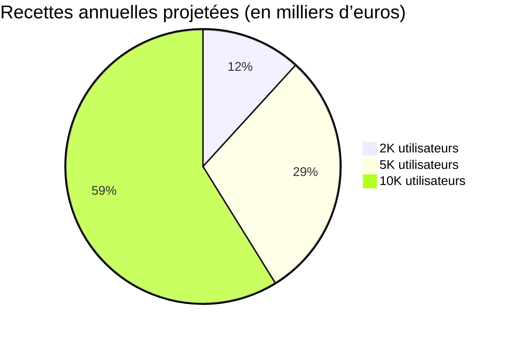

# Résumé exécutif  
Dans un marché des applis linguistiques très concurrentiel, **jibiki** doit combiner une offre gratuite attractive (dictionnaire et outils de base) avec des fonctionnalités avancées payantes (SRS FSRS, export Anki, statistiques, contributions mnémotechniques) afin de maximiser acquisition et rétention. Les concurrents principaux (WaniKani, Bunpro, Memrise, Lingodeer, Anki, Quizlet…) proposent des abonnements mensuels (ex. WaniKani ~9 $/mois, Lingodeer 14,99 $/mois) avec souvent une option annuelle/lifetime (WaniKani 299 $ à vie, Bunpro 150 $, Memrise ~330 $). Le choix freemium + abonnements (mensuel/annuel) avec option achat unique est justifié : le freemium facilite l’acquisition, tandis qu’une licence perpétuelle peut s’adapter à ce logiciel très spécialisé. D’après l’industrie EdTech, la conversion « gratuit→payant » typique est basse (~2–4 %), et la volonté de payer des usagers d’applis éducatives peut être très faible (de l’ordre de 13 % dans une étude). Pour 2 000/5 000/10 000 payants, à ~5€/mois l’utilisateur, on obtient respectivement ~120 k€/an, 300 k€/an et 600 k€/an. Une analyse de sensibilité montre que +20 % sur le prix élève ces chiffres d’autant (144/360/720 k€), mais l’élasticité peut réduire le nombre d’abonnés. Nous recommandons trois paliers tarifaires : **Freemium** (accès dictionnaire complet + lecture de mnémotechniques), **Premium** mensuel/annuel (toutes les fonctions SRS, contributions illimitées, stats, export), et **Licences permanentes** (~99–129 € à vie) pour maximiser le LTV. Un tableau comparatif fonctions/tiers clarifiera ces options pour l’utilisateur. Des tests A/B (prix, durée d’essai, packaging des fonctionnalités) et des KPI (taux de conversion, churn, LTV/CAC, NPS) permettront d’optimiser les prix. En marketing, cibler les apprenants de japonais (étudiants, JLPT, passionnés) via SEO (ex. « dictionnaire kanji visuel »), communautés en ligne, influenceurs linguistiques et événements éducatifs. En rétention, mettre l’accent sur la gamification légère (statuts, badges JLPT), les rappels de révision, la fraîcheur du contenu (nouveaux mnémotechniques, langues ajoutées) et le développement d’une communauté active. Les évolutions produit prioritaires pour justifier l’abonnement sont : amélioration de l’interface SRS (synchro cloud, mobile), génération automatique de cartes SRS enrichies, export/import facile (Anki, CSV), outils de contribution et modération de mnémotechniques, et contenu additionnel (ex. quiz, articles culturels).  

## Tarifs et offre des principaux concurrents  
| **Produit**     | **Offre gratuite** | **Abonnement mensuel** | **Abonnement annuel**         | **Achat à vie**   | **Remarques**                                  |
|-----------------|---------------------|-------------------------|-------------------------------|-------------------|-----------------------------------------------|
| **WaniKani**    | 3 premiers niveaux (Kanji) | 8,99 $/mois  | 89 $/an         | 299 $   | SRS kanji/vocabulaire, mnémoniques anglaises. |
| **Bunpro**      | jusqu’au JPLT N4 (grammaire)    | 5 $/mois     | –                             | 150 $   | SRS grammaire JLPT, intégrations WK.          |
| **Memrise**     | Cours limités   | 24,99 $/mois | 299,88 $/an        | 329,99 $ | Cours multimodaux (incl. japonais), grande audience. |
| **Lingodeer**   | leçon d’essai  | 14,99 $/mois| 95,99 $/an (après promo) | 239,99 $/6 ans | Apprentissage structuré (multilingue).         |
| **Quizlet Plus**| Flashcards illimitées (avec pubs) | ~9,99 $/mois (~3 $ pour Plus Unlimited) | ~44,99 $/an (Plus Unlimited) | –                 | Service flashcards générique (citations non accessibles). |
| **Anki**        | *Logiciel libre desktop & Android* | –                       | –                             | iOS : 24,99 $  | AnkiDroid gratuit, AnkiMobile iOS payant. |

Les prix ci-dessus sont tirés des sites officiels et forums dédiés. On constate que les applications linguistiques de niche facturent typiquement quelques dollars/euros par mois, avec un rabais notable (parfois >50 %) sur l’abonnement annuel et une option licence à vie (en particulier WaniKani, Bunpro, Memrise). Anki reste le standard gratuit, tandis que Quizlet (généraliste) propose un abonnement payant autour de 3–4 $/mois. Ce panorama aide à positionner **jibiki** : un abonnement mensuel modéré (4–6 €) et une licence à vie (ordre de 100 €) sont cohérents avec le marché, surtout en ciblant un usage régulier et des niches spécifiques (JLPT, professionnels).  

## Comportements d’achat et propension à payer  
Les analyses montrent que la **propension à payer** pour les applis d’apprentissage reste faible. Par exemple, une étude trouve seulement 13 % d’étudiants d’une appli d’anglais disposés à payer. De même, un rapport SaaS (éducation) évalue le taux de conversion d’utilisateurs gratuits en payants à ~2,6 % (visiteurs→version gratuite ~13,9 %). Autrement dit, sur 100 000 visiteurs, seuls quelques milliers deviendront abonnés payants. Cette réalité implique de fixer un **prix d’appel attractif** et de bâtir une large base d’utilisateurs gratuits (via freemium) pour nourrir le funnel de conversion.  

Du point de vue pédagogique, l’ajout de mnémoniques visuels et de SRS est fortement bénéfique à l’apprentissage : des études montrent que l’apprentissage avec aides mnémotechniques « audio-visuelles » et répétition espacée peut augmenter la rétention jusqu’à +300 %. Ce constat valide l’essence du produit (dictionnaire enrichi et SRS) et justifie de ne pas limiter drastiquement l’accès aux fonctionnalités pédagogiques clés. Au contraire, il faudra offrir un **avant-goût efficace en freemium** (p. ex. consultation des mémos, un nombre limité de révisions SRS) pour démontrer la valeur ajoutée avant l’abonnement. Par ailleurs, comme le note PayProGlobal (2026), un modèle freemium est souvent la meilleure approche pour les SaaS de niche : « Le modèle économique Freemium fournit une version limitée gratuitement, tandis qu’un abonnement payant donne accès à des fonctionnalités avancées ». On conserve cependant une option d’achat unique/licence perpétuelle pour cibler les utilisateurs très engagés ou ceux préférant éviter les paiements récurrents, dans la lignée des logiciels spécialisés.  

## Modèles de tarification envisagés  
Nous recommandons un modèle **hybride : version de base gratuite + abonnements récurrents + option licence à vie**. Le niveau gratuit doit inclure l’accès complet au dictionnaire et aux mnémotechniques existantes (lecture seule), afin d’attirer un maximum d’utilisateurs et de démontrer la valeur (SEO et bouche-à-oreille). Les fonctionnalités liées à l’apprentissage actif – création de cartes SRS illimitées, planification FSRS, statistiques personnelles, export Anki, contribution/vote de nouveaux mnémotechniques – seront réservées au niveau Premium. Concrètement :  

- **Freemium (0 €)** – Consultation illimitée du dictionnaire (kanji, vocabulaire, grammaire) avec décompositions et ordre de tracé. Accès aux mnémotechniques communautaires actuelles (images, descriptions) en lecture seule. Nombre limité de nouvelles cartes SRS (p. ex. 20 cartes) ou période d’essai SRS (1 mois). Pas d’export/gestion avancée.  
- **Premium Mensuel/Annuel** – Tout le contenu du freemium **+** Système de répétition espacée complet (ajout illimité de nouveaux mots/révisions, rappels journaliers, FSRS-6), statistiques détaillées (courbes de progrès, récapitulatif par niveau/JLPT), export vers Anki/CSV, création et vote de mnémotechniques, modes « immersion » (afficher japonais intégral sans traductions), assistance prioritaire. Tarification par exemple 4,99 € par mois ou 49,99 €/an (tarif indicatif).  
- **Licence à vie** – Accès Premium illimité sans abonnement futur. Proposé autour de 99–129 € (tarif fixe unique). Cette option répond à une demande de certains utilisateurs de retenir un coût fixe (éventuellement utile pour promotions/ventes flash).  

Ce schéma de paliers est cohérent avec les pratiques du secteur. Un **tableau de correspondance** schématisera clairement ces différences :  

| Fonctionnalités                            | Gratuit (Freemium)    | Premium (mensuel/annuel)       | Licence à vie (paiement unique) |
|--------------------------------------------|-----------------------|--------------------------------|---------------------------------|
| Consultation dictionnaire (mots, kanji…)   | ✅ Illimité           | ✅ Illimité                    | ✅ Illimité                     |
| Décomposition kanji & ordre de tracé       | ✅ Incluse            | ✅ Incluse                     | ✅ Incluse                      |
| Accès aux mnémotechniques existantes       | ✅ Lecture seule      | ✅ Lecture et nouveau contenu   | ✅ Lecture et nouveau contenu    |
| Création de cartes SRS (FSRS)              | ❌ Limitée/test       | ✅ Illimitée                   | ✅ Illimitée                    |
| Rappels & planification FSRS avancée       | ❌ (limité)           | ✅ (FSRS complet)              | ✅ (FSRS complet)               |
| Export vers Anki / CSV                     | ❌                    | ✅                             | ✅                              |
| Statistiques de progression et graphiques  | ❌                    | ✅                             | ✅                              |
| Contribution / vote de nouvelles mnémos    | ❌                    | ✅                             | ✅                              |
| Support client prioritaire                 | ❌                    | ✅                             | ✅                              |

Ce modèle fait bénéficier l’utilisateur d’un service utile gratuitement (créant l’acquisition virale) tout en justifiant l’abonnement par des fonctionnalités tangibles. Le prix exact pourra être affiné par A/B tests (voir ci‑dessous) et positionné en décalage pour chaque marché local. En France, on privilégiera l’euro (~5 €/mois, 50 €/an, 99–129 € à vie) pour rester compétitif face à des habitudes de paiement plus basses qu’aux USA.  

## Projections de revenus et analyses de sensibilité  
En partant de hypothèses réalistes (conversion ~2–5 %), voici des ordres de grandeur de recettes annuelles en fonction du nombre d’abonnés payants et du prix mensuel P :  

Pour P≈5€/mois (≈60€/an), on obtient ~2 000×60=120 000 €/an, 5 000×60=300 000 €/an, 10 000×60=600 000 €/an. Si 50 % des abonnés payaient annuellement (à ~50 €/an), le revenu serait légèrement inférieur mais plus prévisible, et si un petit pourcentage choisit la licence à vie, cela générera un pic ponctuel (p.ex. 200 utilisateurs × 99 € = 19 800 € supplémentaires).  

L’analyse de sensibilité montre la dépendance aux deux variables clés : nombre d’abonnés (marché capté) et prix. Par exemple, pour 2 000 abonnés, une augmentation de +20 % du prix à 6€ conduit à ~144 000 €/an, tandis qu’une baisse de -20 % (4 €/mois) donne ~96 000 €/an (et vice versa, le nombre d’abonnés peut varier). Même à 10 000 abonnés, il faut reconnaître que le pallier suivant (20 000) doublerait les revenus. Il est donc essentiel de bâtir à la fois **un pricing attractif** et **des canaux d’acquisition puissants** pour atteindre rapidement les cibles (2–10 k).  

## Tests A/B et métriques clés  
Pour valider la tarification, on pourra mener plusieurs expérimentations :  
- **Prix et durée d’essai** : tester des niveaux mensuels différents (e.g. 4,99€ vs 6,99€) sur des groupes d’utilisateurs équivalents, et mesurer l’impact sur le taux de conversion free→paid, le taux d’abandon, et la LTV. De même, varier la durée d’essai gratuit (14 vs 30 jours) et la présence d’un « usage limité » dans le freemium.  
- **Pack feature vs paywall** : par exemple proposer un essai gratuit des fonctionnalités avancées pour un nombre de cartes, puis verrouiller. Mesurer la progression de l’engagement et du passage à l’abonnement.  
- **Communications tarifaires** : tester différentes formulations sur la page de prix (ex. mettre en avant le coût d’abonnement mensuel vs le coût « café par jour ») ou différentes offres groupées (par ex. ajouter un pack « Parrainage » donnant un mois gratuit).  
- **Offres promotionnelles** : mesurer l’effet de promotions temporaires (réduction sur la licence à vie, 50 % sur 3 mois, etc.) sur le volume d’achat et la valeur perçue.  

Les **indicateurs de performance** à suivre sont : taux de conversion visiteur→inscrit, taux de conversion freemium→payant, churn mensuel, durée de rétention moyenne (customer lifetime), LTV (valeur à vie) comparée au coût d’acquisition (CAC). Dans l’éducation, un bon taux de conversion Freemium→Payant se situe autour de 3–5 % ; il faudra s’en approcher. D’autres métriques clés sont la fréquence d’usage (nombre de sessions de révision par semaine), le taux d’achèvement des révisions FSRS, et des indicateurs de satisfaction (NPS, taux d’engagement des fonctions communautaires). Ces données guideront l’optimisation continue du funnel et du pricing.  

## Go-to-Market et rétention  
**Acquisition :** cibler précisément les niches d’apprenants par le contenu : SEO (ex. articles/blogs sur « apprendre le japonais avec mnémotechniques »), tutoriels YouTube, forums et communautés (r/LearnJapanese, Discord JLPT, etc.). Collaborer avec influenceurs/langage teachers pour démontrer le produit. Utiliser la publicité segmentée (Facebook/Instagram Ads, Google Ads sur requêtes de dictionnaires/kanji) pour un coût maîtrisé. Offrir des abonnements gratuits à des professeurs ou affiliés qui recommanderont jibiki à leurs étudiants. La pression éditoriale (newsletter, réseaux sociaux) doit souligner l’efficacité pédagogique (p. ex. études de cas montrant +300 % de rétention).  

**Rétention :** encourager l’usage quotidien via des fonctionnalités sociales et ludiques : suivi de streak, badges JLPT débloqués, défis mensuels (« réviser 500 kanji »). Intégrer des notifications push/mail de rappel pour les révisions espacées. Valoriser la contribution communautaire (votes sur mnémotechniques, forums intégrés) pour que l’utilisateur se sente acteur de la communauté. Offrir régulièrement de nouveaux contenus (mots rares, dialectes, thèmes spécifiques) et des améliorations (p. ex. nouveaux skins colorés, lecture audio) pour maintenir l’intérêt. Enfin, un support efficace et la transparence (ex. roadmap publique) renforcent la confiance (réponse rapide aux bug, prise en compte des suggestions). Un bon support post-achat (FAQ, tutoriels vidéos) aide à réduire le churn initial.  

## Recommandations produit et conclusion  
Pour justifier pleinement l’abonnement, certaines évolutions doivent être priorisées : **optimisation SRS** (mécanismes FSRS performants, sauvegarde cloud multi-appareils, mode hors-ligne), **outils de création/partage** (éditeur de cartes simple, galeries d’images libres de droits pour mnémos, modération des contributions), et **fonctionnalités premium uniques** (par exemple, tests adaptatifs en vocabulaire, export toutes plateformes). Par ailleurs, améliorer l’ergonomie mobile/web et la rapidité (UX) encouragera la fréquentation. Enfin, envisager l’ajout progressif d’autres langues pourrait élargir la base.  

En résumé, une **tarification freemium modulable** (abonnement vs paiement unique) est cohérente avec notre public et la concurrence. Le prix doit rester accessible (quelques euros par mois) mais crédible pour soutenir le développement continu. Ce modèle, étayé par des tests et un contenu communautaire fort, devrait permettre de transformer un nombre suffisant d’utilisateurs en abonnés et d’atteindre les objectifs de croissance projetés.  

**Sources principales :** pages officielles de tarification (WaniKani, Bunpro, Lingodeer, Anki, Memrise), analyses SaaS et éducatives récentes.