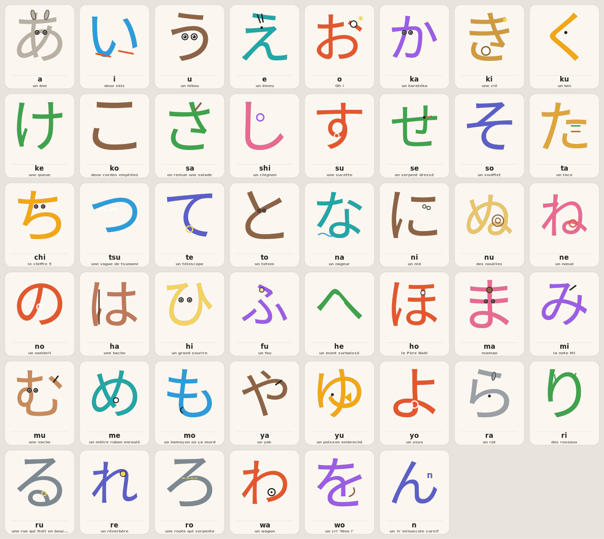

# kana_svg — générateur de dessins mnémoniques SVG pour tous les kana

Génère un **dessin simple en SVG pour chaque hiragana et katakana** (46 + 46 de
base, + 25 + 25 dakuten/handakuten = **142 kana couverts**), en **mode overlay** :
le dessin épouse le trait réel du caractère.



## Le principe (mode overlay)

Chaque carte superpose trois couches, comme l'atelier de dessin de l'app
(`app/lib/views/learn/draw_mascot_view.dart`) :

1. **le glyphe en filigrane** — le vrai contour du kana, très pâle, sert de guide ;
2. **l'illustration** — le glyphe est **teinté dans la couleur de l'objet** puis
   habillé de quelques formes simples. Comme on réutilise le contour réel de la
   police, *le caractère reste toujours exact et lisible* et devient l'objet
   (き = une clé dorée, ぬ = un escargot vert, は = une hache…) ;
3. **la légende** — le romaji + le mot-image dans la langue choisie.

Les associations son↔image viennent d'une **recherche en ligne** (guides *Learn
Hiragana* / *Learn Katakana* de Tofugu), stockées dans `research_*.json` avec, pour
chaque kana, une accroche **en français** et **en anglais** (le lien mnémonique
dépend de la langue : く = « coucou » en FR, « cuckoo » en EN).

Pour les **kanji**, l'overlay n'est **pas obligatoire** : `--no-guide` masque le
glyphe-guide (le brief demandait l'overlay pour les kana seulement).

## Utilisation

```bash
# tous les kana, un SVG autonome par caractère + manifest.json (légendes FR)
python -m kana_svg gen   --out out --lang fr

# planches de contrôle (un grand SVG par syllabaire)
python -m kana_svg sheet --script both --out out

# page d'aperçu autonome (à ouvrir dans un navigateur)
python -m kana_svg html  --out out --lang fr

# options : --script {hiragana,katakana,both} --lang {fr,en}
#           --base-only (46 seulement, sans dakuten) --no-guide (sans filigrane)
```

Seule la commande `cache` a besoin de la police CJK ; tout le reste tourne à partir
de `glyph_paths.json` (contours déjà extraits), donc la génération n'a **aucune
dépendance système**. Dépendance Python unique : `fonttools` (et seulement pour
reconstruire le cache).

```bash
python -m kana_svg cache   # ré-extrait les contours depuis Noto Sans CJK JP
```

## Architecture

| Fichier | Rôle |
|---|---|
| `glyphs.py` | extrait le contour de chaque kana d'une police CJK (fontTools) et le normalise dans un carré 0–100 ; cache → `glyph_paths.json` |
| `dsl.py` | petit DSL de dessin vectoriel : primitives cartoon composables (`line`, `curve`, `blob`, `arc`, `eye`, `smile`, `glyph`…) + pile de transformations |
| `recipes_hiragana.py` / `recipes_katakana.py` | une fonction de dessin `(art, glyph)` par kana de base ; `REGISTRY` associe chaque caractère à sa fonction |
| `recipes.py` | assemble les `Recipe` (dessin + métadonnées + ordre gojūon) ; les dakuten réutilisent la recette de base via décomposition Unicode NFD |
| `render.py` | compose la carte : carte papier → filigrane → illustration → légende ; `standalone`, `contact_sheet`, `cell` |
| `research_*.json` | associations mnémoniques (image + accroche FR/EN + note de forme) issues de la recherche |
| `__main__.py` | CLI (`gen`, `sheet`, `html`, `cache`, `ref`) |
| `_refsheet.py` | outil dev : planche des glyphes avec grille de coordonnées (pour placer les éléments) |

## Modifier / ajouter un dessin

Une recette est volontairement courte. Le repère : carré **0–100**, y vers le bas,
le glyphe occupe ~[18–82]. Pour voir où tombe chaque trait : `python -m kana_svg ref`.

```python
def ki(a, g):                      # き — une clé
    body(a, g, "#d09a3e")          # teinte le glyphe = corps de la clé (laiton)
    a.circle(45, 66, 6, fill=WHITE, color="#8a5a1e", w=1.8)  # l'anneau, dans la boucle
    a.sparkle(72, 22, 3)           # un éclat
```

`body(a, g, couleur)` peint le contour réel du kana + un liseré sombre. Ensuite on
ajoute 1 à 4 formes simples, alignées à l'œil sur la planche de référence.

## Attribution

Les contours de glyphes sont extraits de **Noto Sans CJK JP** (SIL Open Font
License). Les associations mnémoniques s'inspirent des guides **Tofugu** *Learn
Hiragana / Katakana*.
